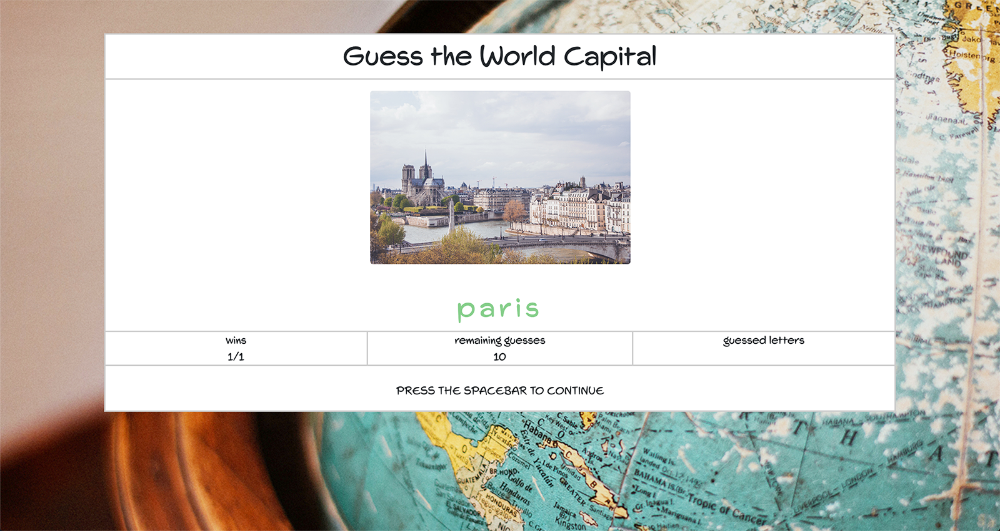
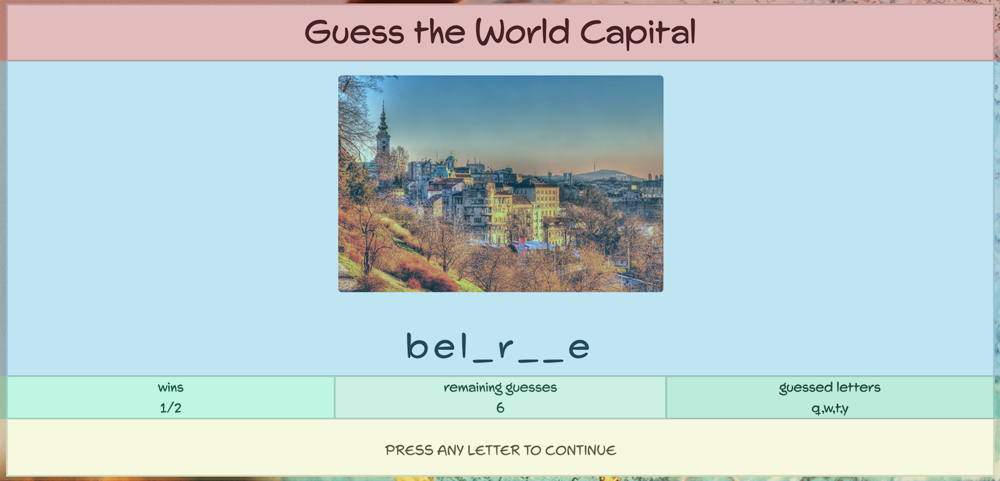
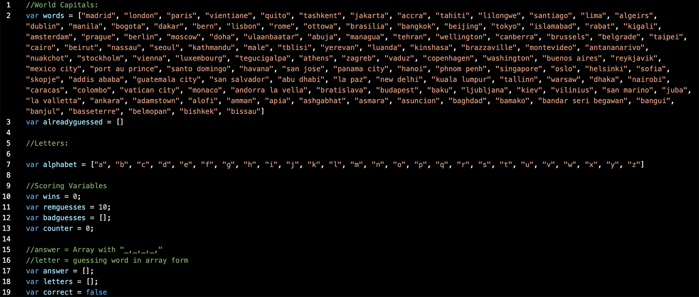
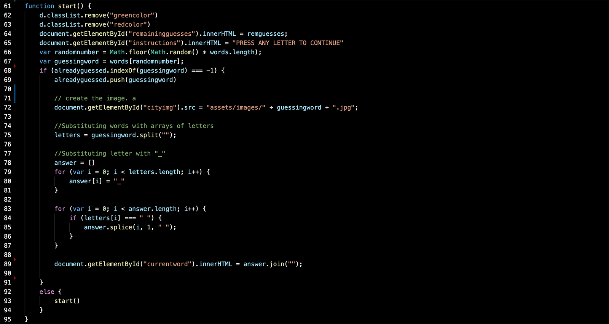
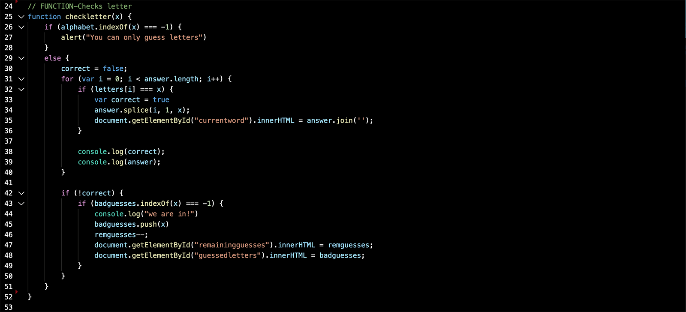
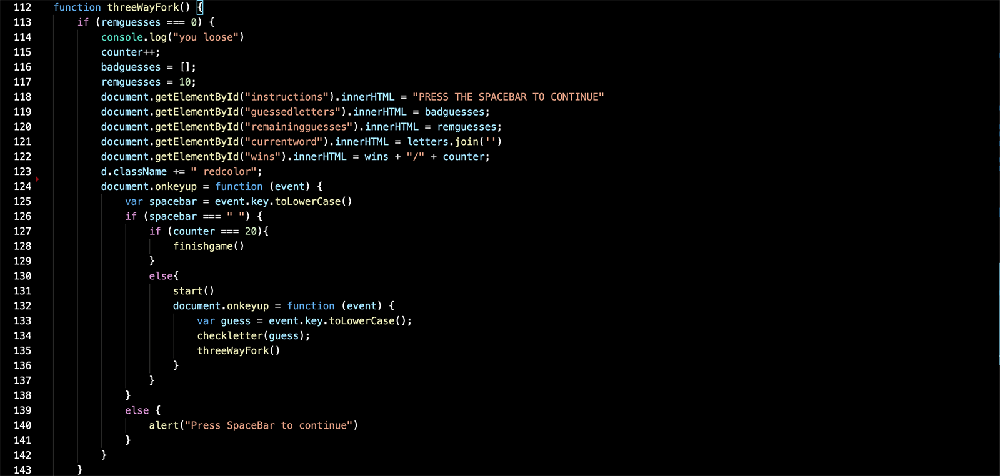
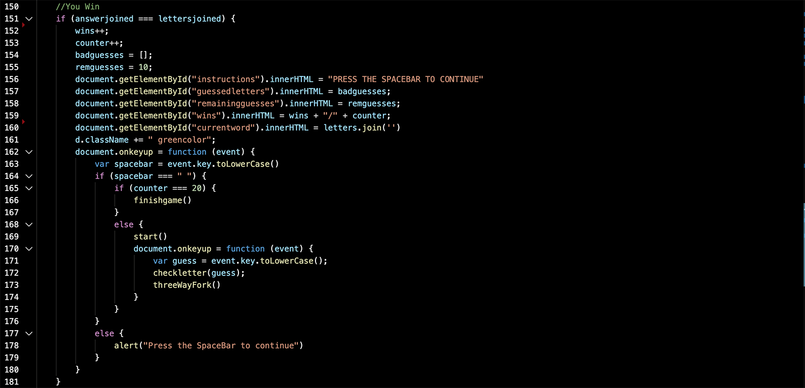
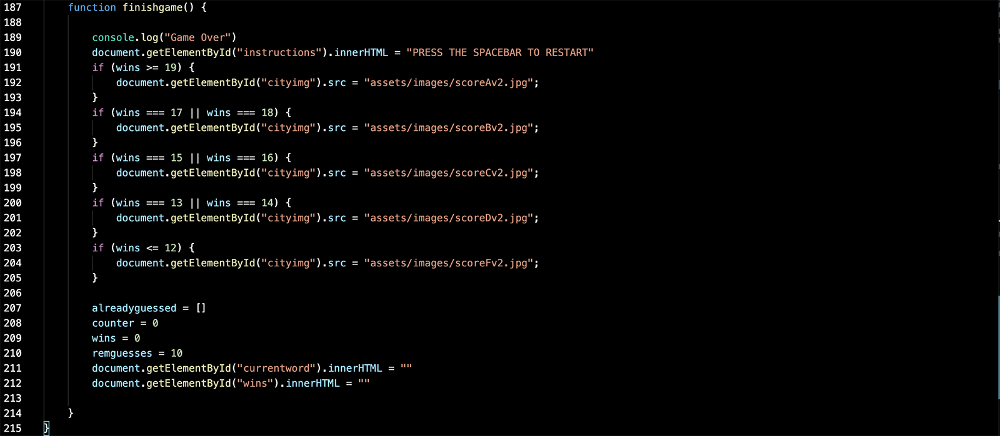
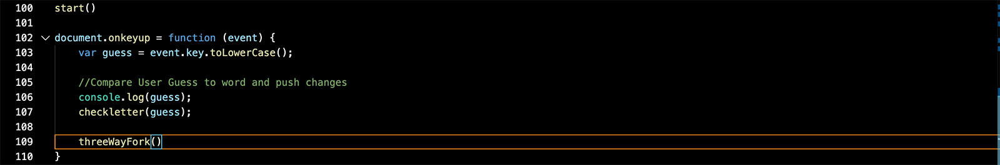

# Wold Capital Guess Game
https://klcosta.github.io/Word-Guess-Game/

The World Capital Guess Game was a homework assignment for the University of Pennsylvania's full stack coding bootcamp. The requirement was to create a word guess game using a single page application. We were only allowed to use JavaScript (no JQuery). The other languages used were HTML and CSS. 

I opted for a world capitals game using images as a clue. The game runs for twenty questions before assesing the user and giving him a final score. 

## Design (HTML & CSS)

The web application uses bootstrap in order to create the overall look. The main container is devided into four rows. The third of row is devided into four columns. A personal CSS file is used to further personalize the application. This is used to add the gray borders in the right places and make sure the image scales down for smaller devices. 

## Implementation (JavaScript) 
### Global Variables

All of the capital city names are stored in one long array. The images corresponding with each city are stored in the assets folder. In order to make sure that all cities are paired with the correct image a similar naming structure is used 'cityname'.jpg. 

Aside from the city name array, the web application uses series of global variables. There is an array called alreadyguess which starts as empty but is used to avoid the same city being used twice; and array called alphabet, which stores all the letters of the alphabet, used to make sure the user can only use letters; there is a wins variable used to store the number of wins; a remguesses variable to store the number of guesses left; a badguesses array to make store eroneous user guesses, counter variable keep track of the number of questions; and answer array to store the answer in a '_,_,_,_,_,_,' format; a letters array to store the correct letters the user is trying to guess and finally a correct variable that will later be used to ensure. 

### Functions

The application works through four main functions start(), which start or restarts the game after each word; checkletter(), which checks each letter typed by the user to see if it is in the word, threeWayFork(), which then determines if the player won, lost or continues and finishgame(), which kicks in after 20 questions to assess the final score.

#### Start()

The start function is the first function called by the web app. It sets up the game, and then each round by eliminating the red or green color from the word (depending on if the user was succesful in guessing the word or not). It updates the remaining guess and instructions and then selects a random word from the words array. It then goes into a loop designed to prevent the same word from reappearing. If the word is not already in the words array it re-runs the start () function. It if is not it pushes the word into the alreadyguessed array. It then pushes the correct image to the web application, splits the letters of the word and stores it into an array called letters using the .split() method. Finally it replaces all of the letters in the word with an "_" and stores it in a array called answer using a for loop. In this final step I use a forloop and the method .splice() to put spaces into the multi word capital cities like Buenos Aires. 

#### CheckLetter()

The second function called is checkletter(). Whenever the user types a letter it is stored in a variable called guess. Guess is passed into the checkletter function. The first if statements ensure that the letter is indeed a letter by ensuring that it matches the alphabet variable described above. If the used indeed typed a letter the function then changes correct from true to false. Then it uses a for-loop to check through all of the letters in the letters array against the users guess. If the letter is in the word, it splices it into the answers array and displays it on the screen, using the .join() method to avoid comas between the letters. The function also changes the variable correct back to true. 

If the for loop ends and the correct variable is still false it makes another if check. If the letter is in the badguesses array the function ends there. If not the remguesses variable is subtracted to by one, the incorret guess is pushed in the badguesses array and both of these are displayed on screen. 

#### ThreeWayFork()

Three way fork is named after the fork that happens after checkletter() is finished. The player either wins, looses or has to continues to guess. Two conditions need to be met. Either the remguess variable equals 0 or the answers array and the letters array equal eachoter (in order to make this comparison both of these arrays are joined and compared). If neither of these conditions are met the user continues guessing. 

If the first condition is met the user looses. The counter variables goes up by one. Then badguesses and remaining guesses are restored to the original value. The color of the word is changed to red by adding the redcolor class to the element and all of the pertinent information is displayed on screen (including the incorrect word, updated instructions and updated score). If the user then presses the spacebar he moves on to the next stage. If the counter equals 0 the finishgame() is run if not the start() function is called. 

If the second condition is met the player wins. The counter and win variables go up by one. Then the badguesses and remaining guess are restored. The color of the word is changed to green by adding the greencolor class to the element. All the pertinent information is displayed on the screen(including the correct word, updated instruction and updated score). If the user then presses the spacebar he moves on to the next stage. If the counter equals 0 the finishgame() is run if not the start() function is called. 

#### FinishGame()

When finish game is called the game calculates the users final score. Depending on the number of wins it will display an image with a score of A, B, C, D or F. All of the variables are like counter and wins are restored to 0 and the pertinent information is displayed on the screen. 

### Code

When the application is opened start() gets called. Then when the user presses a key that value is stored in a variable called guess. That variable is then run through the checkletter() function at the end of which the threeWayFork() function is called. 

